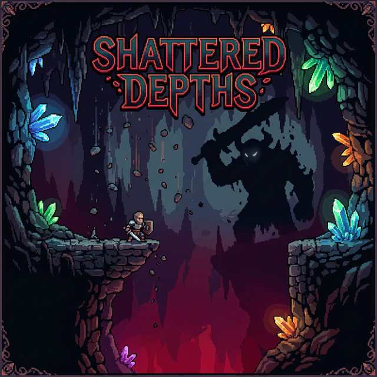

<p align="center">
  
</p>

<h1 align="center">⚔️ SHATTERED DEPTHS</h1>

<p align="center">
  <b>A souls-inspired roguelike action platformer built with Godot 3.x</b>
</p>

<p align="center">
  
  
  
  
</p>

---

## 🎮 About

**Shattered Depths** is a challenging 2D action platformer with souls-like combat, procedurally generated dungeons, and dialogue-driven boss encounters. Dash through enemy attacks, parry to stun, chain melee combos, and switch between four weapon types — all while descending deeper into ever-changing rooms with escalating difficulty.

Every run is different. Every boss has something to say. Every death is a lesson.

---

## ✨ Features

### ⚔️ Deep Combat System
- **3-Hit Melee Combo** — Chain light attacks into a heavy finisher (1 → 1 → 2 damage)
- **Parry** — Frame-perfect timing stuns enemies for 1.5s with screen flash & hit pause
- **Dash** — Burst of speed with invincibility frames (i-frames)
- **Dodge Roll** — Ground-based evasion that passes through enemies
- **Homing Missiles** — Lock-on projectiles with AOE explosions (limited ammo)

### 🔫 4 Weapon Types
| Weapon | Style | Fire Rate |
|--------|-------|-----------|
| 🔫 **Pistol** | Balanced, reliable | 0.20s |
| 💥 **Shotgun** | 5-pellet spread, devastating up close | 0.60s |
| ⚡ **Rapid-Fire** | Bullet hose, high spread | 0.08s |
| 🎯 **Charged Shot** | 3x damage, pinpoint accuracy | 1.00s |

### 🏰 Procedural Dungeons
- **8 unique room layouts** with randomized platform positions each run
- **4 room types**: Combat, Boss, Start, and Rest (+1 HP heal)
- **Difficulty scaling** — more enemies with higher HP as you go deeper
- **Smooth transitions** — fade-to-black between rooms with exit portals

### 👹 Souls-like Bosses
Every 5 rooms, a boss stands in your way. They have something to say about it.

<table>
<tr>
<td width="50%">

**🗡️ The Brute** (30 HP)
> *"Another fool enters my domain... I've crushed a thousand like you."*

3-phase melee tank with stomp, charge, overhead slam, ground pound, and leap attack. Enrages after 45 seconds.

</td>
<td width="50%">

**🔮 The Caster** (25 HP)
> *"How... quaint. A mortal with a gun. I am the storm made flesh."*

3-phase ranged summoner with projectile volleys, teleportation, homing orbs, minion summons, and screen-wide beam.

</td>
</tr>
</table>

- **Multi-phase combat** — behavior changes at 60% and 30% HP
- **Telegraphed attacks** — red flash warnings before strikes
- **Parryable projectiles** — reflect the Caster's shots back
- Powered by [**Dialogic 1.x**](https://github.com/dialogic-godot/dialogic-1) for cinematic dialogue

### 🎬 Game Feel
- **Screen shake** on hits, boss attacks, and parries
- **Hit pause** — 40-100ms freezes for impact on big hits
- **Flash overlays** — white on parry, red on damage, green on heal
- **Combo counter** — kill streak tracker with "3x COMBO!" popups
- **Health pips** — visual heart-style HP display
- **Dash cooldown bar** — cyan when ready, grey when charging

---

## 🕹️ Controls

| Key | Gamepad | Action |
|-----|---------|--------|
| `W A S D` | D-Pad | Move / Aim |
| `K` | A | Jump (double jump) |
| `J` | X | Shoot (hold for auto-fire) |
| `I` | B | Melee attack (3-hit combo) |
| `L` | Y | Dash (air) / Dodge Roll (ground + down) |
| `U` | LB | Fire homing missile |
| `Q` / `E` | — | Switch weapon (prev / next) |

---

## 🚀 Getting Started

### Prerequisites
- [Godot Engine 3.x](https://godotengine.org/download/3.x/) (GLES2)

### Run the Game
```bash
# Clone the repository
git clone https://github.com/Hairic95/Destroy-the-Lizard-Guys.git
cd Destroy-the-Lizard-Guys

# Open in Godot
# 1. Launch Godot 3.x
# 2. Click "Import" → select project.godot
# 3. Press F5 to play!
```

### Export
Pre-configured export presets are included for:
- 🌐 HTML5 (Web)
- 🪟 Windows
- 🍎 macOS
- 🐧 Linux

---

## 📁 Project Structure

```
src/
├── player/
│   ├── MapPlayer.gd          # Player controller (movement, combat, i-frames)
│   ├── WeaponManager.gd      # 4 weapon types with stats
│   ├── MeleeHitbox.gd        # Melee attack detection + parry
│   └── Missile.gd            # Homing missile with AOE
├── Enemies/
│   ├── RunningEnemy.gd        # Base enemy with stun & telegraph
│   ├── BossBase.gd            # Multi-phase boss framework
│   ├── BossBrute.gd           # Melee tank boss (6 attacks)
│   ├── BossCaster.gd          # Ranged summoner boss (7 attacks)
│   └── BossProjectile.gd      # Parryable boss projectile
├── Levels/
│   ├── ProceduralLevel.gd     # Room-by-room procedural gameplay
│   └── RoomGenerator.gd       # 8 platform presets + difficulty scaling
├── Menus/
│   ├── PlayerHUD.gd           # Health pips, dash bar, combo counter
│   └── BossHUD.gd             # Boss health bar with phase markers
├── singleton/
│   └── settings.gd            # Cross-room state persistence
├── ScreenEffects.gd           # Screen shake, hit pause, flash overlay
└── dialogic/timelines/        # Boss dialogue scripts (Dialogic 1.x)
```

---

## 🎯 Game Loop

```
                    ┌─────────────────────────────────┐
                    │         SHATTERED DEPTHS         │
                    └─────────────────────────────────┘
                                    │
                              ┌─────▼─────┐
                              │   START    │
                              │   ROOM     │
                              └─────┬─────┘
                                    │
                    ┌───────────────▼───────────────┐
                    │     COMBAT ROOMS (x4)         │
                    │  Procedural platforms + enemies │
                    │  Difficulty scales with depth  │
                    └───────────────┬───────────────┘
                                    │
                              ┌─────▼─────┐
                              │   BOSS    │◄── Dialogue intro
                              │   FIGHT   │    Phase 2 taunt
                              │  +100 pts │    Defeat speech
                              └─────┬─────┘
                                    │
                    ┌───────────────▼───────────────┐
                    │     MORE COMBAT ROOMS         │
                    │      (harder enemies)         │
                    └───────────────┬───────────────┘
                                    │
                              ┌─────▼─────┐
                              │   REST    │
                              │  ROOM     │◄── Heal +1 HP
                              └─────┬─────┘
                                    │
                              ┌─────▼─────┐
                              │  REPEAT   │──► Infinite depth
                              └───────────┘
```

---

## 🛠️ Built With

- **[Godot Engine 3.x](https://godotengine.org/)** — Open-source game engine
- **[Dialogic 1.x](https://github.com/dialogic-godot/dialogic-1)** — Dialogue & cutscene system
- **GDScript** — Godot's Python-like scripting language

---

## 📜 License

This project is open source under the [MIT License](LICENSE).

---

<p align="center">
  <i>Die. Learn. Descend deeper.</i>
</p>
